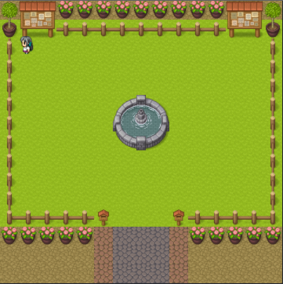

<p align="center">
  <a href="#rocket-tecnologias">Tecnologias</a>&nbsp;&nbsp;&nbsp;|&nbsp;&nbsp;&nbsp;
  <a href="#-projeto">Projeto</a>&nbsp;&nbsp;&nbsp;|&nbsp;&nbsp;&nbsp;
  <a href="#-como-rodar">Como rodar</a>&nbsp;&nbsp;&nbsp;|&nbsp;&nbsp;&nbsp;
  <a href="#-como-contribuir">Como contribuir</a>&nbsp;&nbsp;&nbsp;
  </p>

<br>

# Galeria de fotos com React

## 🚀 Tecnologias

Esse projeto foi desenvolvido com as seguintes tecnologias:

- [JavaScript](https://developer.mozilla.org/pt-BR/docs/Web/JavaScript) 
- [HTML5](https://developer.mozilla.org/pt-BR/docs/Web/HTML/HTML5) 
- [CSS3](https://developer.mozilla.org/pt-BR/docs/Web/CSS) 
- [React Native](https://reactnative.dev/) 
- [Yarn](https://yarnpkg.com/) 
- [NPM](https://www.npmjs.com/) 


## 💻 Projeto

Uma galeria de fotos em React.

Canal [Bonieky Lacerda](https://www.youtube.com/watch?v=ss4BXa-WfgI)

É preciso criar uma conta no firebase e configura o env.example. Renomeie o arquivo env.exemple para env.local e preencha a seguintes variaves com os dados da sua conta: 

```
REACT_APP_FIREBASE_APIKEY=
REACT_APP_FIREBASE_AUTODOMAIN=
REACT_APP_FIREBASE_PROJECTID=
REACT_APP_FIREBASE_STORAGEBUCKET=
REACT_APP_FIREBASE_SENDERID=
REACT_APP_FIREBASE_APPID=
```

<p align="center">
  
</p>

## 🚀 Como Rodar

- Clone o projeto.
- Entre na pasta do projeto e rode npm install.
- "npm start".

## 🤔 Como contribuir

- Faça um fork desse repositório;
- Cria uma branch com a sua feature: `git checkout -b minha-feature`;
- Faça commit das suas alterações: `git commit -m 'feat: Minha nova feature'`;
- Faça push para a sua branch: `git push origin minha-feature`.

Depois que o merge da sua pull request for feito, você pode deletar a sua branch.

## 📝 Licença

Esse projeto está sob a licença MIT.
